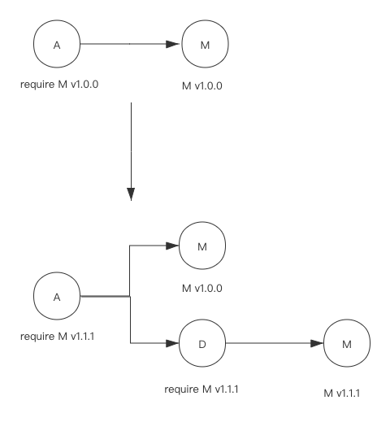

# Go mod 学习之版本选择

go mod 自动为你的项目选择合适的依赖包版本

在前面的章节中，我们使用过 `go get <pkg>` 来获取某个依赖，如果没有特别指定依赖的版本号，go get 会自动选择一个最优版本，并且如果本地有 go.mod 文件的话，还会自动更新 go.mod 文件。

事实上除了 go get，go build 和 go mod tidy 也会自动帮我们选择依赖的版本。这些命令选择依赖版本时都遵循一些规则，本节我们就开始介绍 Go module 涉及到的版本选择机制。

## 版本选择理解

当我们引入项目，go mod 会结合所有依赖包的所有依赖情况，选择依赖包的最合适版本

go get 或 go tidy 下载包时，未指定版本，go mod 会为我们选择该包最合适的版本，同时也会将此依赖信息记录到 go.mod 文件中

## go mod 的语义化版本定范

语义化版本规范 —— 就是版本名字定义让人容易理解，而形成的一套版本命名规范

在 Go module 时代，module 版本号要遵循语义化版本规范，即版本号格式为 `v<major>.<minor>.<patch>`，如 v1.2.3。当有不兼容的改变时，需要增加 major 版本号，如 v2.1.0。

Go module 规定，如果 major 版本号大于 1，则 major 版本号需要显式地标记在 module 名字中，如 module github.com/my/mod/v2。这样做的好处是 Go module 会把 module github.com/my/mod/v2 和 module github.com/my/mod视做两个 module，他们甚至可以被同时引用。

### 依赖包版本约定

关于如何管理依赖包的版本，Go 语言提供了一个规范，并且 Go 语言的演进过程中也一直遵循这个规范。

这个非强制性的规范主要围绕包的兼容性展开。对于如何处理依赖包的兼容性，根据是否支持 Go module 分别有不同的建议。

Go module 之前版本兼容性

在 Go v1.11（开始引入 Go module 的版本）之前，Go 语言建议依赖包需要保持向后兼容，这包括可导出的函数、变量、类型、常量等不可以随便删除。以函数为例，如果需要修改函数的入参，可以增加新的函数而不是直接修改原有的函数。

如果确实需要做一些打破兼容性的修改，建议创建新的包。

比如仓库 github.com/RainbowMango/xxx 中包含一个 package A，此时该仓库只有一个 package：

github.com/RainbowMango/xxx/A

那么其他项目引用该依赖时的 import 路径为：

import "github.com/RainbowMango/xxx/A"

如果该依赖包需要引入一个不兼容的特性，可以在该仓库中增加一个新的 package A1，此时该仓库包含两个包：

github.com/RainbowMango/xxx/A
github.com/RainbowMango/xxx/A1

那么其他项目在升级依赖包版本后不需要修改原有的代码可以继续使用 package A，如果需要使用新的 package A1，只需要将 import 路径修改为 import "github.com/RainbowMango/xxx/A1" 并做相应的适配即可。

Go module 之后版本兼容性

从 Go v1.11 版本开始，随着 Go module 特性的引入，依赖包的兼容性要求有了进一步的延伸，Go module 开始关心依赖包版本管理系统（如Git）中的版本号。尽管如此，兼容性要求的核心内容没有改变：

如果新 package 和旧的 package 拥有相同的 import 路径，那么新 package 必须兼容旧的 package;

如果新的 package 不能兼容旧的 package，那么新的 package 需要更换 import 路径；

在前面的介绍中，我们知道 Go module 的 go.mod 中记录的 module 名字决定了 import 路径。例如，要引用 module module github.com/renhongcai/indirect 中的内容时，其 import 路径需要为 import github.com/renhongcai/indirect。

在 Go module 时代，module 版本号要遵循语义化版本规范，即版本号格式为 `v<major>.<minor>.<patch>`，如 v1.2.3。当有不兼容的改变时，需要增加 major 版本号，如 v2.1.0。

Go module 规定，如果 major 版本号大于 1，则 major 版本号需要显式地标记在 module 名字中，如 module github.com/my/mod/v2。这样做的好处是 Go module 会把 module github.com/my/mod/v2 和 module github.com/my/mod视做两个 module，他们甚至可以被同时引用。

另外，如果 module 的版本为 v0.x.x 或 v1.x.x 则都不需要在 module 名字中体现版本号。

## 版本选择机制

Go 的多个命令行工具都有自动选择依赖版本的能力，如 go build 和 go test，当在源代码中增加了新的 import，这些命令将会自动选择一个最优的版本，并更新 go.mod 文件。

需要特别说明的是，如果 go.mod 文件中已标记了某个依赖包的版本号，则这些命令不会主动更新 go.mod 中的版本号。所谓自动更新版本号只在 go.mod 中缺失某些依赖或者依赖不匹配时才会发生。

### 最新版本选择

当在源代码中新增加了一个 import，比如：

import "github.com/RainbowMango/M"

如果 go.mod 的 require 指令中并没有包含 github.com/RainbowMango/M 这个依赖，那么 go build 或 go test 命令则会去 github.com/RainbowMango/M 仓库寻找最新的符合语义化版本规范的版本，比如 v1.2.3，并在 go.mod 文件中增加一条require 依赖：

require github.com/RainbowMango/M v1.2.3

这里，由于 import 路径里没有类似于 v2 或更高的版本号，所以版本选择时只会选择 v1.x.x 的版本，不会去选择 v2.x.x 或更高的版本。

### 最小版本选择

有时记录在 go.mod 文件中的依赖包版本会随着引入其他依赖包而发生变化。

如下图所示：

Module A 依赖 Module M 的 v1.0.0 版本，但之后 Module A 引入了 Module D，而 Module D 依赖 Module M 的 v1.1.1 版本，此时，由于依赖的传递，Module A 也会选择 v1.1.1 版本。

需要注意的是，此时会自动选择最小可用的版本，而不是最新的 tag 版本。

为什么会选择 v1.1.1 呢？

版本号格式为 `v<major>.<minor>.<patch>`

因为 major 相同，说明是兼容的，v1.1.1 兼容 v1.1.0，同时 v1.1.1 可能有些新特性，需要用到，所以最小可用版本就是 v1.1.1

## 总结

本节我们先是介绍了 Go 语言针对依赖包版本管理的约定，这个不能算是强制性的要求，但如果不遵守该约定，后续该依赖包的使用者将会遇到各麻烦，最终有可能弃用这个不规范的依赖包。

接着介绍了 Go module 机制所采用的自动版本选择算法，除了自动版本选择以外，我们还可以显式地指定依赖包的版本。另外，除了在 go.mod 文件中指定依赖的 tag 版本号以外，还可以使用假的版本号，这些内容我们将在后续的章节中分别展开介绍。
